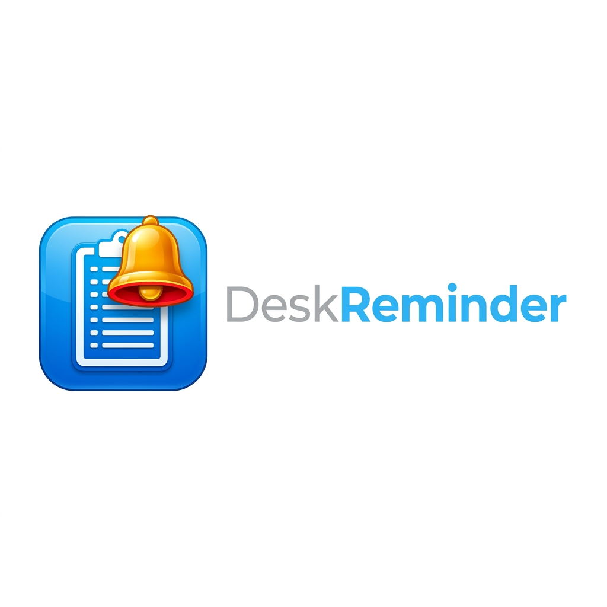

# DeskReminder

<p align="center">
  
</p>

<p align="center">
  A lightweight, offline-first desktop reminder widget for personal productivity.<br/>
  Inspired by Windows Sticky Notes, Microsoft To Do, and modern desktop widgets.
</p>

<p align="center">
  
  
  
  
</p>

---

## ✨ Features

| Feature | Description |
|---|---|
| 🪟 **Frameless Widget** | Draggable, always-on-top, smooth collapse/expand |
| ⚡ **Quick Add** | Natural language: *"Gym tomorrow 6 AM"*, *"Submit Friday"* |
| 📌 **Sticky Notes** | Float reminders as editable sticky notes with colour themes |
| ⏱️ **Pomodoro Timer** | Built-in focus timer (25/5, 50/10, or custom) with session history |
| 🗄️ **Offline Database** | All data stored locally in SQLite — no account needed |
| 🔔 **Notifications** | Desktop alerts with Snooze and Dismiss |
| 🎨 **Themes** | Dark, Light, and Glassmorphic modes |
| 🖱️ **Resizable UI** | Drag borders or corners to resize the widget freely |
| 🔵 **Color-Coded Buttons** | Minimal, icon-free design — buttons are colored circles |
| 🗂️ **System Tray** | Minimize to tray; right-click for quick actions |

---

## 🚀 Quick Start

### Prerequisites

- Python **3.10+** (tested on 3.14)  
- pip

### 1 — Clone the repository

```bash
git clone https://github.com/DharshanSP/focus-dock.git
cd focus-dock
```

### 2 — Install dependencies

```bash
pip install -r requirements.txt
```

### 3 — Launch the app

```bash
python main.py
```

---

## 🖥️ Run as a Desktop App (Windows)

### Option A — Double-click launcher (no console)

Double-click **`DeskReminder.bat`** in the project folder.  
The app will start silently in the background — no terminal window.

### Option B — Create a Desktop Shortcut

1. Right-click your Desktop → **New → Shortcut**
2. Set the target to:
   ```
   C:\Windows\System32\cmd.exe /c "cd /d "C:\path\to\focus-dock" && start "" pythonw main.py"
   ```
3. Name it **DeskReminder**
4. Right-click the shortcut → **Properties → Change Icon** → browse to `assets\logo.ico`

### Option C — Build a standalone `.exe`

```bash
pip install pyinstaller
pyinstaller --onefile --windowed --icon=assets/logo.ico main.py
```

The executable will be in the `dist/` folder. Copy it anywhere and run it directly.

---

## 🎮 How to Use

### Adding a Reminder

- **Quick Add** (top bar): Type naturally, e.g. `Doctor appointment 3 PM tomorrow`, and press **Enter**.
- **Standard Add** (➕ button): Fill in a detailed form with date, time, priority, category, and recurrence.

### Managing Reminders

| Button Color | Action |
|---|---|
| 🟢 Green dot | Edit the reminder |
| 🔴 Red dot | Delete the reminder |

### Widget Controls (top-right dots)

| Button Color | Action |
|---|---|
| 🔵 Cyan | Toggle Always-on-Top (Pin) |
| 🟠 Orange | Minimize to floating bubble |
| 🟣 Purple | Open Settings |
| 🔴 Dark Red | Exit / Close the app |

> Press **`?`** (top-left) to view the full guide anytime.

### Keyboard Shortcuts

| Shortcut | Action |
|---|---|
| `Ctrl + N` | New Reminder |
| `Ctrl + F` | Focus Search Bar |
| `Ctrl + D` | Cycle Themes |

### Sticky Notes

1. Open a reminder via ➕ or edit.
2. Check **"Open as Sticky Note"** in the form.
3. A floating, coloured sticky note will appear on your desktop.

### Pomodoro Focus Timer

1. Click **⏱️ Focus Timer** in the widget.
2. Choose a session type: 25/5, 50/10, or Custom.
3. Press **Start** — get notified when it's time for a break.

---

## 🏗️ Project Structure

```
focus-dock/
├── main.py                 # Entry point
├── DeskReminder.bat        # One-click launcher (Windows)
├── build_app.bat           # PyInstaller build script
├── requirements.txt        # Python dependencies
├── assets/
│   ├── logo.png            # App logo
│   └── logo.ico            # App icon (for shortcuts/exe)
├── database/               # SQLite connection & schema
├── models/                 # Data models (Reminder, etc.)
├── repositories/           # Data access layer (CRUD)
├── services/               # Business logic (reminders, parsing)
├── scheduler/              # Background notification scheduler
├── ui/                     # All PyQt6 UI components
│   ├── widget.py           # Main widget window
│   ├── forms.py            # Add/Edit/Settings forms
│   ├── sticky.py           # Sticky note window
│   ├── pomodoro.py         # Pomodoro timer view
│   ├── notification_window.py  # Alert popup
│   └── styles.py           # CSS-like theming
├── tray/                   # System tray integration
├── utils/                  # Helper utilities
└── tests/                  # Unit tests
```

---

## 🛠️ Tech Stack

- **Python 3.14**
- **PyQt6** — Desktop GUI framework
- **SQLite + JDBC** — Local offline database
- **PyInstaller** *(optional)* — Package as `.exe`

---

## 📄 License

This project is open source. Feel free to fork, extend, and contribute!
